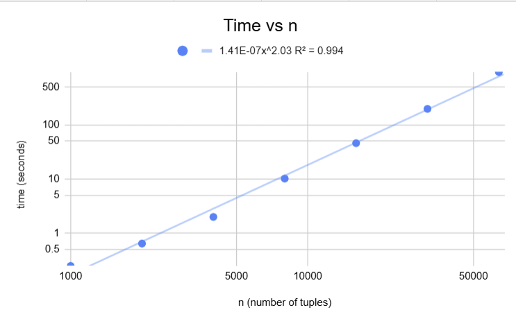
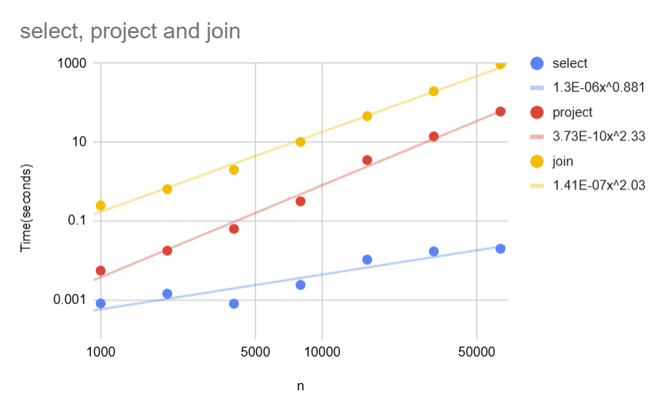

# Performance Report

**Machine:** Dell XPS 15 9510, 11th Gen Intel Core i9-11900H @ 2.50 GHz (8 cores, 16 threads), 32 GB RAM
**OS:** Windows 11 Home, version 25H2 (OS build 26200.9457), 64-bit
**Language:** Java 11.0.30 (Eclipse Temurin / OpenJDK), run from IntelliJ IDEA with default JVM settings

## 8.3 Results: `R join[R.b=S.b] S`
| n | m | comparisons | wall time (s) | output tuples |
|---|---|---:|---:|---:|
| 1000 | 1000 | 1000000 | 0.2467198 | 1000 |
| 2000 | 2000 | 4000000 | 0.6395859 | 2000 |
| 4000 | 4000 | 16000000 | 1.9839564 | 4000 |
| 8000 | 8000 | 64000000 | 10.1434531 | 8000 |
| 16000 | 16000 | 256000000 | 45.7273655 | 16000 |
| 32000 | 32000 | 1024000000 | 196.4985094 | 32000 |
| 64000 | 64000 | 4096000000 | 944.0608236 | 64000 |

## 8.4 

### Question 1: 
The exact relationship is comparisons = n × m, where n is the number of tuples in relation R and m is the number of tuples in relation S. This is because the nested-loop join compares every tuple in R with every tuple in S exactly once. My measured comparison counts match this formula exactly. For example, when n = 32,000 and m = 32,000, the engine performed 1,024,000,000 comparisons, which is exactly 32,000 × 32,000. At n = 64,000 and m = 64,000, it performed exactly 4,096,000,000 comparisons. Therefore, there is no discrepancy between the expected and measured comparison counts.

### Question 2:

The slope of the log-log plot is 2.03 (power trendline T ≈ 1.41 × 10⁻⁷ · n^2.03, R² = 0.994). Because log T = log c + k · log n, the slope k is the exponent in nᵏ, so a slope of about 2 means the running time grows quadratically. Doubling n roughly quadruples the time. This is exactly what a nested-loop join should do. With n = m, it compares every tuple of R with every tuple of S, performing n² comparisons, and the running time follows that comparison count.

### Question 3:

Queries used: `select[b<100](R)` and `project[b](R)` on the same R as the join experiment. Each was run once untimed as a warm-up, then timed once.

| n | select examined | select time (s) | project time (s) | join time (s) |
|---|---:|---:|---:|---:|
| 1000 | 1000 | 0.0008061 | 0.0054807 | 0.2467198 |
| 2000 | 2000 | 0.0014183 | 0.0175623 | 0.6395859 |
| 4000 | 4000 | 0.0007903 | 0.0627984 | 1.9839564 |
| 8000 | 8000 | 0.0023775 | 0.3144156 | 10.1434531 |
| 16000 | 16000 | 0.0104247 | 3.5063986 | 45.7273655 |
| 32000 | 32000 | 0.0168709 | 13.9883061 | 196.4985094 |
| 64000 | 64000 | 0.0196200 | 59.8971840 | 944.0608236 |

**Select vs join:** The select curve has slope 0.881, close to 1 (it isn't exactly 1 because such short runs are easily affected by background activity on the computer), while the join has slope 2.03. Select examines each tuple exactly once (the select counter equals n at every size), so its work grows linearly with n. The join compares every pair of tuples (n × m), so its work grows with n². At n = 64,000, select takes 0.02 seconds while the join takes 944 seconds.

**Project vs join:** The project curve has slope 2.33, much closer to the join than to select, even though projection only needs one pass over the input. The cause is duplicate removal: `Relation.addTuple` uses `tuples.contains(tuple)`, which scans the whole output list on every insert, adding about n²/2 checks (n tuples × n/2 checks each = n²/2.) . Project is still faster than the join (60 seconds versus 944 seconds at n = 64,000).

### Question 4

**Time per comparison:**
944.06 s ÷ 4,096,000,000 comparisons ≈ 2.305 × 10⁻⁷ s ≈ 230 nanoseconds per comparison

**Comparisons at one million tuples on each side:**
1,000,000 × 1,000,000 = 10¹² comparisons

**Predicted time:**
10¹² × 2.305 × 10⁻⁷ s ≈ 230,500 seconds
230,500 ÷ 3,600 ≈ 64 hours 

Therefore the predicted time would be around 64 hours.

### Question 5

Ran `R join[R.b=S.b] S` with n = m = 4,000 and changed only the match rate (how many S tuples each R tuple joins with).

| match rate | comparisons | wall time (s) | output tuples |
|---:|---:|---:|---:|
| 0 | 16,000,000 | 3.40 | 0 |
| 1 | 16,000,000 | 3.47 | 4,000 |
| 2 | 16,000,000 | 3.67 | 8,000 |
| 5 | 16,000,000 | 8.69 | 20,000 |
| 10 | 16,000,000 | 33.34 | 40,000 |

Changing the match rate does not change the comparison count. It stays at exactly 4,000 × 4,000 = 16,000,000, because the nested-loop join checks every pair of tuples whether or not they match. It cannot know a pair matches until it checks it.

Changing the match rate does change the wall time, from 3.40 seconds with no matches to 33.34 seconds at match rate 10. The difference is the work done for each match. Every matching pair is added to the output with `Relation.addTuple`, which checks the new tuple against every tuple already in the output to remove duplicates. More matches means a bigger output, and each new tuple has more tuples to check against, so this extra work grows much faster than the output. Doubling the output from 20,000 to 40,000 made the time spent beyond the no-match baseline go up by about 5.7 times (8.69 − 3.40 = 5.29 s at rate 5, and 33.34 − 3.40 = 29.94 s at rate 10; 29.94 ÷ 5.29 ≈ 5.7). So the comparison count only measures the cost of finding matches, while the wall time also includes the cost of producing the output.

### Question 6

To make the million-tuple join feasible, I would replace the nested-loop join with a hash join. Right now, for every tuple in R, the join scans all of S looking for matches, which is 10¹² comparisons at a million tuples each. A hash join instead goes through S once and groups its tuples by their b value in a hash table, so all S tuples with the same b end up together. Then it goes through R once, and for each R tuple it looks up only the group with the matching b value instead of scanning all of S. This cuts the work from about 10¹² comparisons to about 2 million steps (one pass over each relation), bringing the time down. I would also change the join to check the condition before building a combined tuple, since it currently builds one for every pair even though most pairs do not match, and I would make `Relation.addTuple` use a hash-based set so it no longer scans the whole output list to remove duplicates. A hash join only works for equality conditions like R.b = S.b, which is what this query uses.
